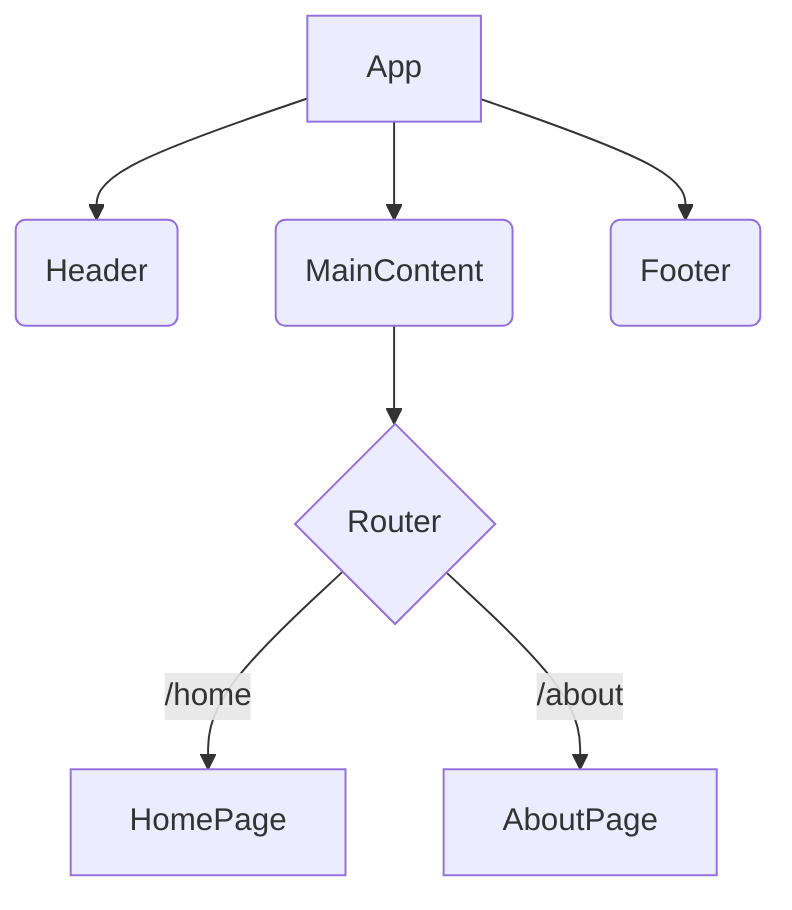

# 프로젝트 개요: react-hub 🚀

React 개발의 진입장벽을 해소하는 종합 가이드

탄탄한 기초부터 고급 디자인 패턴까지, 코드 중심의 예제와 시각적 다이어그램으로 학습하세요

----------------------------------------

📋 목차

 * ✨ 프로젝트 소개
 * 🎯 주요 기능
 * 🏗️ 프로젝트 구조
 * 🚀 빠른 시작
 * 📚 학습 콘텐츠
 * 🎨 디자인 패턴 다이어그램
 * 💡 사용 기술
 * 🤝 기여하기
 * 📈 로드맵
 * 📞 연락처
 * 📄 라이선스

----------------------------------------

✨ 프로젝트 소개

React Hub는 React 개발을 처음 시작하는 개발자들을 위한 종합적인 학습 플랫폼입니다. 복잡한 개념을 시각적 다이어그램과 실무 중심의 예제 코드로 쉽게 설명하여, 개발자들이 React의 핵심 개념을 빠르게 습득할 수 있도록 돕습니다.

<!-- Minor update for re-push -->

🎯 프로젝트 목표

 * 진입장벽 해소: **기본적인 JavaScript 지식이 있는 개발자**들이 복잡한 React 개념을 직관적으로 이해할 수 있도록 시각화
 * 실무 중심 학습: 실제 프로젝트에서 사용되는 패턴과 구조를 예제로 제공
 * 종합적 가이드: 기초부터 고급까지 단계별 학습 로드맵 제공
 * 최신 기술 반영: React 18+ 기준의 최신 기능과 모범 사례 포함

----------------------------------------

🎯 주요 기능

📖 **핵심 디자인 패턴 및 개념**

 * 컴포넌트, Hooks, Context API 등 필수 개념
 * HOC, Render Props, Custom Hooks 등 고급 패턴
 * Mermaid 다이어그램으로 시각적 이해 제공
 * 실제 React 코드 예제 포함

🛠️ **다양한 개발 환경 지원**

 * Vite: 모던 프런트엔드 빌드 도구
 * TypeScript: 타입 안전성을 위한 언어
 * Tailwind CSS: 유틸리티 우선 CSS 프레임워크

🌐 **실무 적용 가이드**

 * 상태 관리 전략 (Context API, Recoil, Zustand 등)
 * 성능 최적화 기법 (Memo, useCallback, useMemo)
 * 테스트 전략 (React Testing Library, Jest)

----------------------------------------

🏗️ 프로젝트 구조

react-hub/
├── 📁 src/                        # 📖 React 애플리케이션 소스 코드
│   ├── assets/                   # 🖼️ 이미지, 아이콘 등 정적 자산
│   ├── components/               # 🧩 재사용 가능한 React 컴포넌트
│   │   ├── MermaidDiagram.jsx    # 📊 다이어그램 렌더링 컴포넌트
│   │   └── Navbar.jsx            # 🧭 내비게이션 컴포넌트
│   ├── pages/                    # 📄 메인 문서 페이지들
│   │   ├── Home.jsx              # 🏠 홈페이지
│   │   ├── BasicConcepts.jsx     # 💡 기본 개념 가이드
│   │   ├── AdvancedPatterns.jsx  # 🎨 고급 패턴 가이드
│   │   ├── StateManagement.jsx   # 🔄 상태 관리 가이드
│   │   ├── Performance.jsx       # ⚡ 성능 최적화 가이드
│   │   └── Testing.jsx           # 🧪 테스트 가이드
│   ├── styles/                   # 💅 Tailwind CSS 설정 및 전역 스타일
│   ├── App.jsx                   # 🎯 메인 애플리케이션
│   └── main.jsx                  # 🚀 애플리케이션 진입점
├── 📁 public/                     # 📂 정적 파일 (index.html 등)
├── 📋 package.json                # 📋 의존성 관리 및 스크립트
├── 📋 tailwind.config.js           # 🎨 Tailwind CSS 설정
├── 📋 vite.config.js              # 🛠️ Vite 설정
├── 📋 tsconfig.json               # 📝 TypeScript 설정
└── 📖 README.md                   # 📘 이 파일

----------------------------------------

🚀 빠른 시작

📋 필요 조건

 * Node.js 18+
 * npm 또는 yarn
 * Git

🔧 로컬 개발 환경 설정

# 1. 저장소 클론
git clone [저장소 URL]
cd react-hub

# 2. 의존성 설치
npm install

# 3. 개발 서버 시작
npm run dev

개발 서버가 http://localhost:5173에서 실행됩니다.

🏗️ 빌드 및 배포

# 프로덕션 빌드
npm run build

# 빌드 결과 미리보기
npm run preview

----------------------------------------

⚠️ **빌드 유의사항: Tailwind CSS PostCSS 플러그인 설정**

이 프로젝트는 `spring-boot-hub` 레포지토리와의 호환성을 위해 `tailwindcss` v3.x 버전을 사용합니다. `tailwindcss` v4.x부터 PostCSS 플러그인이 별도의 `@tailwindcss/postcss` 패키지로 분리되었으므로, 빌드 시 관련 오류가 발생할 수 있습니다.

**오류 방지를 위한 설정:**
*   `package.json`의 `tailwindcss`, `postcss`, `autoprefixer` 버전을 `spring-boot-hub`의 `react-app`에서 사용된 버전(예: `tailwindcss@3.3.0`, `postcss@8.4.24`, `autoprefixer@10.4.14`)으로 맞춥니다.
*   `postcss.config.js` 파일에서 `plugins` 설정을 `tailwindcss: {}`로 유지해야 합니다.

최신 `tailwindcss` v4.x를 사용하려면 `@tailwindcss/postcss`를 설치하고 `postcss.config.js`를 업데이트해야 하지만, 현재 프로젝트는 v3.x 기반으로 설정되어 있습니다.

----------------------------------------

📚 학습 콘텐츠

🎨 **핵심 디자인 패턴 및 개념**

| 패턴/개념       | 설명                 | 다이어그램 | 예제 코드 |
| :-------------- | :------------------- | :--------- | :-------- |
| 컴포넌트        | UI 구성의 기본 단위  | ✅         | ✅        |
| Props           | 컴포넌트 간 데이터 전달 | ✅         | ✅        |
| State           | 컴포넌트 내부 상태 관리 | ✅         | ✅        |
| Hooks           | 함수형 컴포넌트에서 상태 및 생명주기 관리 | ✅         | ✅        |
| Context API     | 전역 상태 관리       | ✅         | ✅        |
| HOC             | 컴포넌트 재사용 로직 | ✅         | ✅        |
| Render Props    | 렌더링 로직 공유     | ✅         | ✅        |
| Custom Hooks    | 재사용 가능한 로직 추출 | ✅         | ✅        |

🛠️ **빌드 도구 가이드**

 * 🔧 Vite: 빠르고 가벼운 개발 서버
 * 📝 TypeScript: 정적 타입 검사
 * 💅 Tailwind CSS: 효율적인 스타일링

🌐 **실무 적용 가이드**

 * 상태 관리 라이브러리 비교 (Recoil, Zustand 등)
 * React Router를 이용한 라우팅
 * API 연동 및 데이터 페칭 전략
 * 웹 접근성 (Accessibility)

----------------------------------------

📖 **용어집/개념 설명**

React 학습에 필요한 주요 용어와 개념을 설명합니다.

*   **JSX**: JavaScript를 확장한 문법으로, React에서 UI를 기술할 때 사용됩니다. HTML과 유사한 구조를 JavaScript 코드 내에서 작성할 수 있게 해줍니다.
*   **Virtual DOM**: 실제 DOM의 가벼운 사본으로, React는 변경 사항을 Virtual DOM에 먼저 적용하고, 실제 DOM과의 차이를 비교하여 최소한의 변경만 실제 DOM에 반영합니다. 이를 통해 성능을 최적화합니다.
*   **Component**: UI를 구성하는 독립적이고 재사용 가능한 단위입니다. 함수형 컴포넌트와 클래스형 컴포넌트가 있습니다.
*   **Props (Properties)**: 부모 컴포넌트에서 자식 컴포넌트로 데이터를 전달할 때 사용되는 읽기 전용 속성입니다.
*   **State**: 컴포넌트 내부에서 관리되는 변경 가능한 데이터입니다. `useState` Hook을 사용하여 관리합니다.
*   **Hooks**: 함수형 컴포넌트에서 상태 관리 및 생명주기 기능을 사용할 수 있게 해주는 함수들입니다. `useState`, `useEffect`, `useContext` 등이 있습니다.
*   **Context API**: 컴포넌트 트리를 통해 데이터를 직접 전달하지 않고도 전역적인 데이터를 공유할 수 있는 방법입니다.
*   **Lifecycle Methods**: 클래스형 컴포넌트에서 컴포넌트의 생성, 업데이트, 제거 시점에 특정 작업을 수행할 수 있도록 하는 메서드들입니다. (함수형 컴포넌트에서는 `useEffect` Hook으로 대체)
*   **SPA (Single Page Application)**: 단일 HTML 페이지를 로드하고, JavaScript를 사용하여 페이지의 내용을 동적으로 업데이트하는 웹 애플리케이션입니다.

----------------------------------------

❓ **문제 해결/FAQ**

React 개발 중 자주 발생하는 문제와 해결 방법을 안내합니다.

**Q1: `useState`를 사용했는데 상태가 즉시 업데이트되지 않아요.**
**A1:** `useState`의 상태 업데이트는 비동기적으로 처리됩니다. 상태가 업데이트된 직후의 값을 사용해야 한다면 `useEffect` Hook을 사용하거나, 상태 업데이트 함수에 콜백 함수를 전달하는 방식을 고려하세요.

**Q2: 컴포넌트가 불필요하게 여러 번 렌더링되는 것 같아요.**
**A2:** React 컴포넌트는 props나 state가 변경될 때, 또는 부모 컴포넌트가 렌더링될 때 다시 렌더링될 수 있습니다. `React.memo`, `useCallback`, `useMemo` Hook을 사용하여 불필요한 렌더링을 최적화할 수 있습니다. React DevTools를 사용하여 렌더링 원인을 분석해 보세요.

**Q3: `useEffect` Hook의 의존성 배열을 비워두면 어떻게 되나요?**
**A3:** 의존성 배열을 비워두면 `useEffect` 내의 콜백 함수는 컴포넌트가 마운트될 때 한 번만 실행되고, 언마운트될 때 클린업 함수가 실행됩니다. 이는 `componentDidMount` 및 `componentWillUnmount`와 유사하게 동작합니다.

**Q4: `key` prop은 왜 필요한가요?**
**A4:** React에서 리스트를 렌더링할 때 각 항목에 고유한 `key` prop을 제공해야 합니다. `key`는 React가 리스트의 항목들을 식별하고, 변경 사항을 효율적으로 업데이트하는 데 도움을 줍니다. `key`가 없거나 고유하지 않으면 성능 저하 및 예상치 못한 동작이 발생할 수 있습니다.

Q5: CORS(Cross-Origin Resource Sharing) 오류가 발생해요.
**A5:** 프런트엔드 애플리케이션이 다른 도메인의 API 서버에 요청할 때 발생하는 보안 문제입니다. 개발 환경에서는 프록시 설정을 통해 해결할 수 있으며, 프로덕션 환경에서는 백엔드 서버에서 CORS 헤더를 올바르게 설정해야 합니다.

----------------------------------------

🎨 디자인 패턴 다이어그램

프로젝트의 모든 디자인 패턴은 Mermaid.js를 사용하여 시각화될 예정입니다.

📊 다이어그램 종류

 * 🏗️ 컴포넌트 계층 구조 다이어그램: 컴포넌트 간의 관계 시각화
 * ⏰ 상태 흐름 다이어그램: 상태 변화 및 데이터 흐름 표현
 * 🌊 라우팅 플로우차트: 페이지 이동 및 라우팅 로직 도식화

🎯 주요 다이어그램 예시

----------------------------------------

💡 사용 기술

🎨 **프런트엔드**

| 기술          | 버전    | 용도                 |
| :------------ | :------ | :------------------- |
| React         | 18.x    | UI 라이브러리        |
| Vite          | 4.x     | 빠른 번들러 및 개발 서버 |
| Tailwind CSS  | 3.x     | 유틸리티 CSS 프레임워크 |
| React Router  | 6.x     | 클라이언트 사이드 라우팅 |
| TypeScript    | 5.x     | 타입 안전성          |
| Mermaid.js    | Latest  | 다이어그램 렌더링    |

🚀 **배포**

 * GitHub Pages: 정적 사이트 호스팅
 * GitHub Actions: CI/CD 자동화
 * Vite: 최적화된 프로덕션 빌드

----------------------------------------

🤝 기여하기

React Hub 프로젝트에 기여해주셔서 감사합니다!

📝 기여 방법

 1. 🍴 Fork 이 저장소
 2. 🌿 브랜치 생성 (git checkout -b feature/amazing-feature)
 3. 💾 변경사항 커밋 (git commit -m 'Add amazing feature')
 4. 📤 브랜치에 푸시 (git push origin feature/amazing-feature)
 5. 🔄 Pull Request 생성

🐛 버그 리포트

버그를 발견하셨다면 Issues에서 리포트해주세요:

 * 🔍 현재 동작: 어떤 일이 일어나고 있는지
 * ✅ 예상 동작: 어떤 일이 일어나야 하는지
 * 📝 재현 단계: 문제를 재현하는 방법
 * 💻 환경 정보: OS, 브라우저, Node.js 버전 등

💡 기능 제안

새로운 기능 아이디어가 있으시면:

 * 🎯 목적: 이 기능이 왜 필요한지
 * 📋 상세 설명: 어떻게 동작해야 하는지
 * 🎨 예시: 가능하다면 목업이나 예시

----------------------------------------

📈 로드맵

🔮 향후 계획

 * 🔐 React Suspense 및 Concurrent Mode 심화 가이드
 * ☁️ Next.js/Remix 등 프레임워크 통합 가이드
 * 📊 성능 모니터링 및 최적화 심화
 * 🧪 고급 테스트 전략 및 TDD 적용
 * 🌍 다국어 지원 (English)

📅 다음 버전 (V2.0)

 * 인터랙티브 코드 에디터 추가
 * 실시간 예제 실행 환경 구축
 * 개인 학습 진도 추적 기능
 * 커뮤니티 Q&A 섹션

----------------------------------------

📞 연락처

 * 🐙 GitHub: @[당신의 GitHub ID]
 * 🌐 프로젝트 링크: [당신의 프로젝트 GitHub URL]
 * 📖 라이브 데모: [당신의 프로젝트 라이브 데모 URL]

----------------------------------------

📄 라이선스

이 프로젝트는 MIT License로 배포됩니다. 자세한 내용은 LICENSE 파일을 참조하세요.

----------------------------------------

⭐ 이 프로젝트가 도움이 되셨다면 스타를 눌러주세요!

더 많은 개발자들이 React를 쉽게 학습할 수 있도록 도와주세요 🚀
